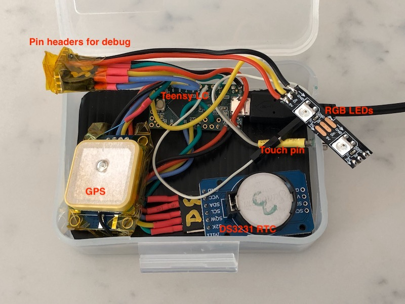

# AboutTimeServer
This is a system to initialize and calibrate the ageing registers of a DS3231 RTC module using GPS as a reference.
It also can be used as a time reference source via USB in conjunction with the PC application AboutTimeClient
which is at https://github.com/RocketManRC/AboutTimeClient.

This uses my u-blox-m8 library which is optimized for timing applications:

https://github.com/RocketManRC/u-blox-m8 (automatically downloaded and installed by PlatformIO).

This runs on the Teensy LC (and most likely Teensy 3.x or 4.x). The U/I is entirely
via the USB Serial port.

It requires a u-blox M8 GPS with PPS (optional) with the following connections:

GPS tx  -> pin 0
GPS rx  -> pin 1
GPS PPS -> pin 2

If you don't have a PPS connection then set the USEPPS define to 0. This will cause
about +- 5ms of error in the initialzation of the DS3231 and and about the same amount 
of jitter in the reference data coming over the USB serial port.

The GPS is powered by 5V on pin Vin but the I/O is 3.3V

Also required is a DS3231 module:

DS3231 SQW -> pin 20
DS3231 SCL -> pin 19
DS3231 SDA -> pin 18

The DS3231 is powered by 3.3V

# Usage
The commands on the serial terminal are:

    'i' - initialize the RTC. This waits for the GPS to have more than 6 satellites and 
            estimate time error of less than 100ns.
    'o' - makes the RTC 5 seconds later than GPS. This is for testing.
    'a' - read the ageing register (not really needed).
    '+' - add one to the ageing register, max is 127
    '-' - subtrack one from the ageing register. Max offset is 128 (starts at 255).

The data output to the terminal is as follows:

    'rt'    ->  the RTC time and date at the last SQW interrupt.
    't'     ->  the GPS time at the last PPS interrupt.
    'dt'    ->  the difference in microseconds between the SQW interrupt and the PPS interrupt.
                This is circular so varies between 0 and 999999.
    'dtt'   ->  the total difference in microseconds between SQW and PPS (+ or -).
    'dcy'   ->  this is from a free running 16bit counter on Teensy LC and is the difference
                between SQW and PPS. It give a little bit better feedback on the drifting of the 
                clock. The idea is to get the change in this to be as small as possible.
    'taac'  ->  this is the estimated time accuracy in nanoseconds from the GPS.
    'numsv' ->  the number of satellites used in the GPS solution. More than 6 is good.

# Packaging

Nothing fancy here, I just stuffed everything in a plastic box that was once the packaging for a large R/C servo:

